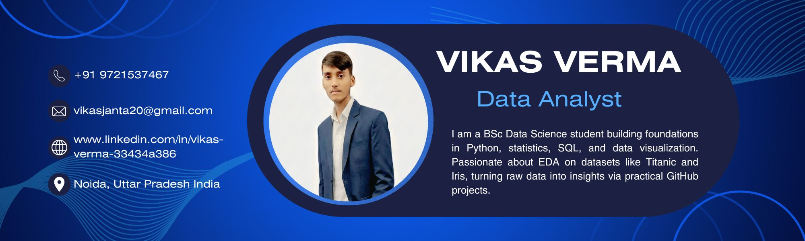

  

###

###

<h1 align="left">💫 About Me:</h1>

###

###

<h3 align="left">🎓 I’m currently working on building a strong foundation in Python, statistics, and data analysis as a first‑semester BSc Data Science student.  👯 I’m looking to collaborate on beginner‑friendly data projects, notebooks, and small ML experiments that help me learn real‑world problem solving.  🤝 I’m looking for help with writing clean Python code, mastering SQL queries, and understanding core math behind data science.  🌱 I’m currently learning Python, Excel, basic statistics, and Git/GitHub to manage and share my projects.  💬 Ask me about my learning journey in data science, how I organize my study routine, or the projects I’m planning next.  ⚡ Fun fact: I enjoy turning daily life problems into small coding or data projects to practice what I learn.</h3>

###

<h1 align="left">🌐 Connect me:</h1>

###

  
  

###

<h1 align="left">💻 Tech Stack:</h1>

###

  
  
  
  
  
  
  
  
  
  
  
  
  
  
  
  

###

<h1 align="left">📈 GitHub Stats:</h1>

###

  
  
  
  

###
# 📊 GitHub Stats:
 
 

---

<!-- Proudly created with GPRM ( https://gprm.itsvg.in ) -->
